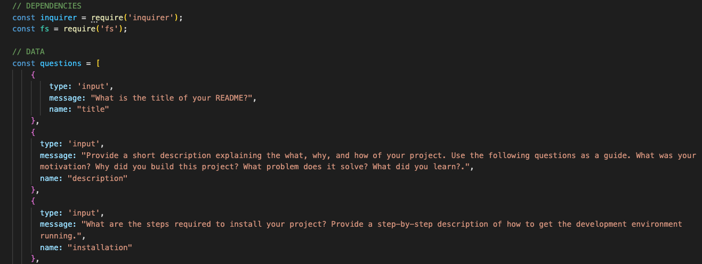

# README Generator

## Description

The motivation for this project was to utilize node and the JavaScript features associated with it.

This project is extremely convenient, as programmers need a README for any application they create and/or deploy. Automating this process through node and JavaScript is not only a great way to streamline the process of deploying future applications but also to apply newly learned concepts to real-world problems.

I learned how to use markdown syntax within JavaScript, originally a very foreign concept to me. I further solidified my understanding of template literals. I also became better acquainted with node and how to find and fix bugs.  

## Usage

The usage of this application is relatively straightforward:

Once you've initialized inquirer (npm i inquirer@8.2.4) and used npm init, you can use this app. 

Open a new terminal in the index.js file and enter "node index" to begin. Then, answer the questions as they appear. When the questions are fininshed, you will receive a message that your README has been created. Open it and take a look!

